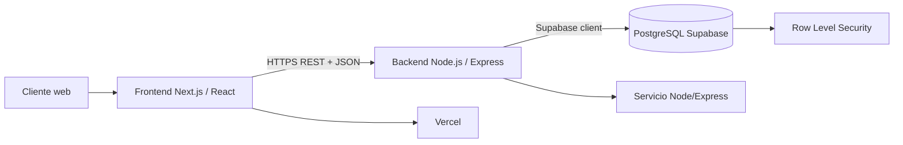
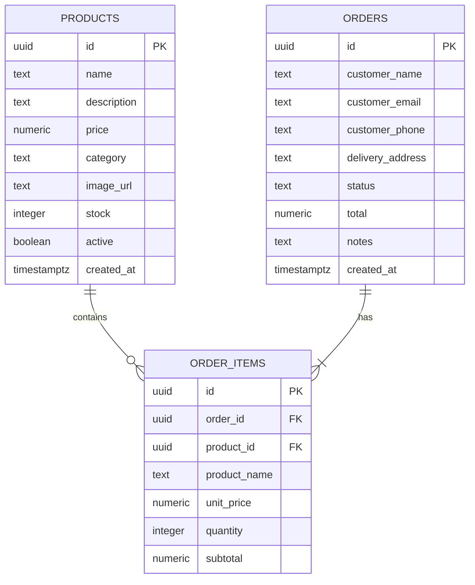

# Maxima Kraft — ABP

Aplicación web full-stack para centralizar el catálogo y la recepción de pedidos de pequeños negocios. El proyecto responde a la problemática de gestionar productos y ventas mediante WhatsApp, cuadernos y mensajes dispersos, reduciendo errores de registro y mejorando la trazabilidad.

## 1. Datos del proyecto

- **Título:** Desarrollo de una aplicación web Full-Stack (React + Node.js/Express) con PostgreSQL para la gestión de catálogo y pedidos.
- **Integrante:** María Isabel López Figueroa.
- **Metodología:** Agile / Scrum Web con sprints e integración continua.
- **Alcance:** catálogo público, búsqueda, filtros por categoría, carrito, detalle del pedido, formulario de entrega y API básica de productos/pedidos. No incluye pagos, analítica avanzada, notificaciones ni módulos ajenos a la problemática.

## 2. Problema y pregunta problema

Muchos emprendimientos locales registran productos y pedidos en canales manuales. Esto ocasiona información duplicada, errores de inventario, pedidos incompletos y poca trazabilidad para tomar decisiones.

**Pregunta problema:** ¿De qué manera una aplicación web Full-Stack con arquitectura RESTful y backend persistente permite centralizar el catálogo y los pedidos de un pequeño negocio, reduciendo en un 50% los errores manuales de registro?

## 3. Justificación tecnológica

React/Next.js permite construir una interfaz responsive y reutilizable; Express separa el backend como API RESTful independiente; Supabase proporciona PostgreSQL administrado, políticas RLS y disponibilidad cloud. La separación frontend/backend facilita mantenimiento, pruebas y despliegue independiente, mientras que la validación en ambas capas protege la integridad de los pedidos.

## 4. Objetivos SMART

### General
Diseñar y desarrollar una aplicación Full-Stack con React, Node.js/Express y PostgreSQL para gestionar el catálogo y los pedidos, con respuestas objetivo menores a 500 ms y diseño responsive validable con Lighthouse superior a 85/100 al finalizar el ciclo académico.

### Específicos
1. Diseñar el modelo de productos, pedidos y detalle de pedidos, junto con wireframes responsive.
2. Desarrollar endpoints RESTful e integrarlos con catálogo, carrito y checkout.
3. Ejecutar pruebas funcionales y de seguridad, y desplegar frontend, backend y base de datos en la nube.

## 5. Metodología Agile / Scrum

- **Sprint 1 — Arquitectura:** análisis, modelo relacional, Supabase y estructura del repositorio.
- **Sprint 2 — Desarrollo:** API Express, interfaz React, catálogo, carrito y checkout.
- **Sprint 3 — Calidad y nube:** validaciones, RLS, pruebas manuales, documentación y despliegue.

Cada sprint se integra mediante commits incrementales y una revisión funcional del flujo completo.

## 6. Arquitectura



### Componentes
- **Frontend:** Next.js App Router, React, Tailwind CSS y componentes reutilizables.
- **Backend:** Express + TypeScript, rutas separadas para productos y pedidos, Zod, CORS y middleware de errores.
- **Persistencia:** Supabase PostgreSQL.
- **Despliegue:** frontend en Vercel; backend Express en un servicio Node compatible; base de datos en Supabase.

## 7. Modelo entidad-relación



## 8. API REST

Base URL: `http://localhost:4000` en desarrollo.

| Método | Endpoint | Descripción |
|---|---|---|
| GET | `/api/products` | Lista productos activos. |
| POST | `/api/products` | Crea un producto validado. |
| GET | `/api/products/:id` | Consulta un producto. |
| PATCH | `/api/products/:id` | Actualiza un producto. |
| DELETE | `/api/products/:id` | Desactiva/elimina un producto. |
| GET | `/api/orders` | Lista pedidos para administración. |
| POST | `/api/orders` | Crea un pedido y sus ítems; recalcula total con precios server-side. |
| PATCH | `/api/orders/:id/status` | Actualiza el estado permitido del pedido. |

El frontend usa `NEXT_PUBLIC_API_URL` para consumir Express. Las respuestas siguen el formato `{ data }` y los errores `{ error }`.

## 9. Seguridad y buenas prácticas

- Validación y sanitización de entradas con Zod en Express y restricciones SQL.
- Consultas Supabase parametrizadas; no se construyen consultas SQL con strings del usuario.
- CORS limitado mediante `FRONTEND_URL`.
- RLS habilitado en `products`, `orders` y `order_items`.
- Solo productos activos se exponen públicamente.
- El total se calcula en el backend con el precio almacenado, nunca con el total enviado por el cliente.
- Se validan cantidades, stock, correo, dirección y estados permitidos.
- HTTPS debe habilitarse en producción. Las claves secretas permanecen en el backend.

## 10. Instalación local

```bash
pnpm install
pnpm dev
```

En otra terminal, iniciar el backend:

```bash
cd backend
pnpm install
pnpm dev
```

Variables del frontend:

```env
NEXT_PUBLIC_API_URL=http://localhost:4000
```

Variables del backend:

```env
PORT=4000
FRONTEND_URL=http://localhost:3000
SUPABASE_URL=...
SUPABASE_SERVICE_ROLE_KEY=...
```

No publicar archivos `.env` ni claves de Supabase en GitHub.

## 11. Pruebas y evidencias

Flujo funcional a evidenciar: cargar catálogo, buscar y filtrar, agregar producto, observar confirmación, abrir detalle del pedido, ajustar cantidades, completar datos y recibir confirmación.

Pruebas técnicas recomendadas:

```bash
pnpm build
cd backend && pnpm build
```

También debe comprobarse que una cantidad superior al stock, un correo inválido o un pedido vacío sean rechazados. Para la entrega se recomienda anexar capturas del catálogo, carrito, confirmación de pedido, respuesta HTTP y panel de Supabase sin exponer secretos.

## 12. Estructura del repositorio

```text
app/                 Frontend Next.js
components/          Interfaz del catálogo y checkout
lib/api.ts           Cliente HTTP hacia Express
public/products/     Imágenes de productos
backend/src/         API Express TypeScript
backend/src/routes/  Rutas de productos y pedidos
```

## 13. Criterios de evaluación cubiertos

- **Análisis y justificación:** problema delimitado, pregunta problema, objetivos SMART y selección tecnológica argumentada.
- **Arquitectura y buenas prácticas:** frontend desacoplado, backend Express modular, PostgreSQL, RLS, validación y cálculo server-side.
- **Repositorio:** código organizado, instrucciones reproducibles, diagramas Mermaid y variables documentadas.
- **Material técnico:** el README contiene narrativa del problema, arquitectura, modelo ER, API, seguridad, pruebas y despliegue; las capturas del flujo sirven como soporte visual.
- **Rigor técnico:** separación de responsabilidades, integridad referencial, control de stock, validación, CORS y despliegue cloud.

## 14. Limitaciones

La versión se limita a funcionalidades básicas a nivel de usuario. No implementa pagos, autenticación administrativa completa, inventario transaccional avanzado, notificaciones, facturación, analítica ni integración con WhatsApp.

## Licencia

Proyecto académico para la asignatura Lenguaje de Programación para la Web.
